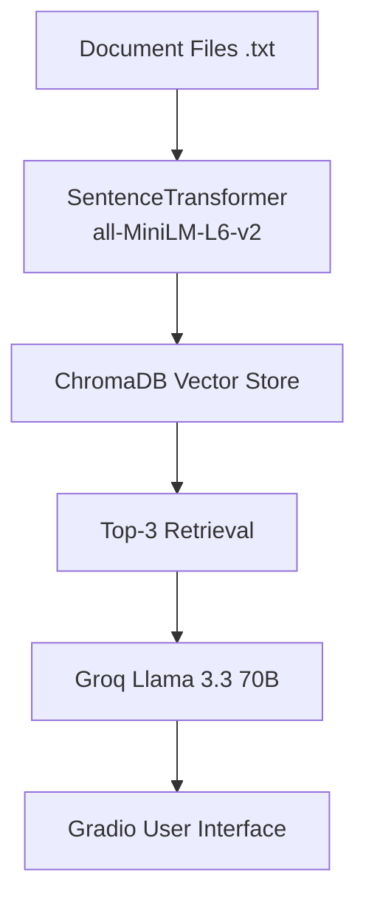

# Project 1 Planning: Guide

---

## Domain

<!-- What domain did you choose? Why is this knowledge valuable and hard to find through official channels? -->
The domain is Python programming fundamentals. This knowledge is valuable because beginners often need quick explanations of core Python concepts such as variables, data types, lists, dictionaries, functions, loops, conditionals, file handling, error handling, and object-oriented programming. Rather than searching through long tutorials, users can ask questions and receive answers grounded in a curated collection of Python learning documents.

---

## Documents

<!-- List your specific sources: URLs, subreddit names, forum threads, or file descriptions.
     Aim for at least 10 sources that together cover different subtopics or perspectives within your domain. -->

| #| Source                   | Description                                       | URL or location                  |
| -| -------------------------| --------------------------------------------------| ---------------------------------|
| 1| python_variables.txt     | Python variables, assignment, and dynamic typing  | documents/python_variables.txt|
| 2| python_data_types.txt    | Python data types including strings, integers etc | documents/python_data_types.txt  |
| 3| python_lists.txt         | Python lists, indexing, and common list operations| documents/python_lists.txt       |
| 4| python_dictionaries.txt  | Python dictionaries and key-value pair storage    | documents/python_dictionaries.txt|
| 5| python_functions.txt     | Python functions, parameters, and return values   | documents/python_functions.txt   |
| 6| python_loops.txt         | Python for loops, while loops, and loop controls  | documents/python_loops.txt       |
| 7| python_conditionals.txt  | Python if, elif, and else conditional statements  | documents/python_conditionals.txt|
| 8| python_file_handling.txt | Reading, writing, and managing files in Python    | documents/python_file_handling.txt|
| 9| python_error_handling.txt| Exception handling using try and except blocks    | documents/python_error_handling.txt|
|10| python_oop.txt           | Object-oriented programming (classes and object)  | documents/python_oop.txt         |

---

## Chunking Strategy

<!-- How will you split documents into chunks?
     State your chunk size (in tokens or characters), overlap size, and explain why those
     numbers fit the structure of your documents.
     A review-heavy corpus warrants different chunking than a long FAQ. -->

**Chunk size:** Entire document (1 chunk per document)

**Overlap:** 0

**Reasoning:** The documents are short educational notes, each covering a single Python topic. Splitting them further would separate related information and reduce retrieval quality. Because each document is less than 1,000 characters, storing each document as a single chunk is sufficient.

---

## Retrieval Approach

<!-- Which embedding model are you using (e.g., all-MiniLM-L6-v2 via sentence-transformers)?
     How many chunks will you retrieve per query (top-k)?
     If you were deploying this for real users and cost wasn't a constraint, what tradeoffs
     would you weigh in choosing a different embedding model — context length, multilingual
     support, accuracy on domain-specific text, latency? -->

**Embedding model:** all-MiniLM-L6-v2 (Sentence Transformers)

**Top-k:** 3

**Production tradeoff reflection:** The all-MiniLM-L6-v2 model is lightweight, fast, and performs well for semantic search on short educational documents. For a production system, I would consider larger embedding models with stronger multilingual support, better domain-specific understanding, and longer context handling. The tradeoff would be increased cost, storage requirements, and latency.

---

## Evaluation Plan

<!-- List your 5 test questions with their expected correct answers.
     Questions should be specific enough that you can judge whether the system's response
     is right or wrong. "What are good dining halls?" is too vague.
     "What do students say about wait times at [dining hall name] during lunch?" is testable. -->

| # | Question                             | Expected answer                                                           |
|---| ------------------------------------ | --------------------------------------------------------------------------|
| 1 | What is a Python variable?           | A Python variable stores data and is created when a value is assigned to it. |
| 2 | What is a list?                      | A list is an ordered and mutable collection that can store multiple items and allows duplicate values.|
| 3 | What is a dictionary?                | A dictionary stores data as key-value pairs and is useful for organizing labeled information.|
| 4 | What is object oriented programming? | Object-oriented programming (OOP) organizes code using classes and objects and supports concepts such as encapsulation, inheritance, polymorphism, and abstraction.|
| 5 | Who won the 2022 FIFA World Cup?     | The system should refuse to answer and respond with "I do not know" because the information is not present in the document collection.|

---

## Anticipated Challenges

<!-- What could go wrong? Name at least two specific risks with reasoning.
     Consider: noisy or inconsistent documents, missing source attribution, off-topic
     retrieval, chunks that split key information across boundaries. -->

1. Retrieval may return related but not exact documents when multiple Python concepts are semantically similar.

2. The model may attempt to answer questions outside the document collection unless grounding instructions are enforced.

---

## Architecture

<!-- Draw a diagram of your pipeline showing the five stages:
     Document Ingestion → Chunking → Embedding + Vector Store → Retrieval → Generation
     Label each stage with the tool or library you're using.
     You can use ASCII art, a Mermaid diagram, or embed a sketch as an image.
     You'll use this diagram as context when prompting AI tools to implement each stage. -->

---

## Architecture

---

## AI Tool Plan

<!-- For each part of the pipeline below, describe:
     - Which AI tool you plan to use (Claude, Copilot, ChatGPT, etc.)
     - What you'll give it as input (which sections of this planning.md, which requirements)
     - What you expect it to produce
     - How you'll verify the output matches your spec

     "I'll use AI to help me code" is not a plan.
     "I'll give Claude my Chunking Strategy section and ask it to implement chunk_text()
     with my specified chunk size and overlap" is a plan. -->

**Milestone 3 — Ingestion and chunking:**
AI Tool: ChatGPT
Input: Domain section, Documents section, and Chunking Strategy section from planning.md.
Expected Output: Python code to load all .txt files from the documents folder and prepare them for embedding. Since the documents are short, each document will be stored as a single chunk with no overlap.
Verification: Confirm that all 10 documents are loaded successfully and that the document count matches the number of files in the documents folder.

**Milestone 4 — Embedding and retrieval:**
AI Tool: ChatGPT
Input: Retrieval Approach section, selected embedding model (all-MiniLM-L6-v2), and retrieval requirements from the project guide.
Expected Output: Code that generates embeddings using SentenceTransformer, stores them in ChromaDB, and retrieves the top 3 most relevant documents for a query.
Verification: Test retrieval with questions about variables, lists, dictionaries, and object-oriented programming. Verify that the returned documents are relevant to the query.

**Milestone 5 — Generation and interface:**
AI Tool: ChatGPT
Input: Retrieval pipeline design, grounding requirements, and query interface requirements from the project guide.
Expected Output: Code that sends retrieved context to Groq's Llama 3.3 70B model and displays responses through a Gradio interface.
Verification: Confirm that in-domain questions return grounded answers and that out-of-scope questions such as "Who won the 2022 FIFA World Cup?" return "I do not know."